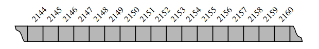
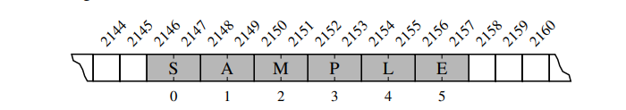
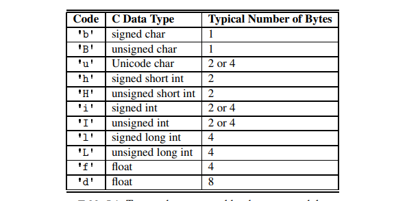

# Low-Level Arrays

The primary memory of a computer is composed of bits of information, and those bits are typically grouped into larger units that depend upon the precise system architecture.

Such a typical unit is a byte, which is equivalent to 8 bits.

A computer uses a memory address to keep track of what information is stored in what byte.

Each byte of memory is associated with a unique number that serves as its address, that is the binary representation of those unique numbers.



Despite the sequential nature of the numbering system, computer hardware is designed, in theory so that any byte of the main memory can be efficiently accessed based upon its memory address.

A computers main memory performs as random access memory (RAM). Meaning, it is just as easy to retrieve byte #8675309 as it is to retrieve byte #309. An individual byte of a memory can be stored or retrieved in O(1) time.

Python represents each character using the Unicode character set, and on most computing system, a unicode character is represented using 16bits, i.e 2 bytes.

Therefore a six character string, such as 'SAMPLE', would be stored in 12 consecutive bytes of memory.



Each location within an array is refered to as a cell.

Each cell in an array must occupy the same number of bytes, this is what allows its content to be accessed in constant time based on its index.

If one knows the memory address at which an array starts, the number of bytes per element, and a desired index within the array, the appropriate memory address can be computed using calculation, start + cellsize * index.

e.g, say the array starts at memory location 2145, and each cell is represented by 2 bytes, the memory location of an element at a particular index lets say 4 will be:

2145 + 2 * 4 = 2145 + 8 = 2153

Say you want to store values that can have arbitrary sizes, knowing that the values stored in the cells of the sequence has to take up the same number bytes, how do you do this, do you take up memory for the most size of the value you can ever store? No that would be wasteful, instead python represents them as an array of object references. At the lowest level, what is stored is a consecutive sequence of memory addresses at which the elements of the sequence reside.

This works because the number of bits used to store the memory address of each element is fixed (64-bits per address).

the None type is an object.

When you compute a slice of a list, the result is a new list instance, but that new list has references to the same elements that are in the original list.

When you extend an array using the extend method, you dont receive the actual copies of those elements, but a reference to those elements.

# Compact Arrays

Strings are represented as an array of characters, not an array of references. These structure or representation is called a compact array, as its stores the primary value of the data not a reference.

Python allows you to query the actual number of bytes being used for the primary storage of any object. **This is done using the getsizeof function of the sys module**. An integer is represented on most operating systems as 14byte. Well beyond the 4 bytes used by python to store an int object, making the total 18 bytes per entry.

Even though a list maintains careful ordering of the sequence of memory addresses, where those elements reside in memory is not determined by the list. This is because of the workings of the cache and memory hierarchies of computers, it is often advantageous to have data stored in memory near other data that might be used in the same computations.

You can create compact arrays for integers, floats and other chars using the built in array library.

The public interace for the array class conforms mostly to that of a Python list. However, the constructor for the array class requires a type code as a first parameter, which is a character that designates the type of data that will be stored in the array.

e.g 'i' represents signed integers that are represented in memory using 16 bits each.

The type codes used are based on the C programming languages natice data types. 



The array module does not provide support for making compact arrays of user-defined data types. Compact arrays of such structures can be created with the lower level support of a module named ctypes.

# Dynamic Arrays and Amortization

Dynamic arrays are arrays that can be resized trivally. An array usually has a fixed size, as values are stored in consecutive blocks of memory, if you want to resize the array, say add another element to it, the operating system cannot just trivally add another block to the number of blocks used, as that block may be used by another program to store its data. For immutable python sequence types such as tuples or strings, this poses no problems, but the list type is mutable, and its size can easily be increased and decreased, why? well a list of say 5 elements will usually be represented on the lower level as 8 blocks, to support insertion of new elements, but what if you keep inserting elements into that list, you will eventually pass the limit of 8 blocks, how does the interpreter handle this? it requests for new memory of the new size plus a few extra blocks, stores the elements there, and then "frees" the old memory block used. 

The getsizeof function returns the number of bytes that are being used to store an object in Python.

For a list, it reports the number of bytes devoted to the array and other instance variables of the list, but not any space devoted to elements referenced by the list.

Each object in python maintains some state, for example a reference to denote the class to which it belongs.

Big-Omega notations provide an asymptotic way of saying that a function grows at a rate that is 'greater than or equal' to that of another.

For dynamic arrays, using an algorithmic design pattern called amortization, we charge each insertion operation lets say 3 cyber points, and we use 1 for the insertion, store two, when the insertion overflows, and a new array is requested, we have enough cyber points to cover copying the items into the new array bearing in mind that each operation costs 1 cyber point, and we have 2 * n left. We can then copy the elements into the new array and then insert a new element, and store the remaining cyber points.

The key to performance is that the amount of additional space is proportional to the current size of the array.

# Memory Usage and Shrinking an Array

When working on a dynamic array, an important feature to take note of is how the data structure behaves when elements are removed from the array, if elements are removed from the array and the array does not resize itself, then the memory used will no longer be proportional to the number of elements, in this case, we have to provide a way to shrink the memory as the number of elements decreases.


Proportionality can be thought of as two numbers maintaining the same ratio when compared to each other, e.g 8 is proportional to 4 becase the ratio of 8 and 4 is 2, which can be written as 2:1. This means that the numbers maintain the same ratio when compared to each other.

take this list for example

1,2,3,4,0,0,0,0

The number of elements is 4 and the size of the array is 8, so they are proportional. But when we remove an element from the list we get

1,2,3,0,0,0,0,0

The number of elements become 3, and the size is still 8, 8 is not proportional to 3, so then how do we shrink this array so that the size of the array is proportional to the number of elements in the array.

A strategy could be to half the capacity of the array whenever the number of actual elements falls below one fourth of that capacity, thereby guaranteeing that the array capacity is at most four times the number of elements.

When you see * in the asymtotic notation of an algorithm, that means that the operation is amortized e.g O(1)*

Inserting at the beginning of a list uses linear time, as the middle of the list requires about half the time as inserting at the beginning. Inserting at the end uses constant time akin to append.

The parameterized version pop(k), removes the element that is at index k < n of a list, shifting all subsequent elements leftward to fill the gap that results from the removal.

This implies that poping at the begining of the array is the most costly operation as this uses linear time to resize the array.

It is better to use the builtin python functions or methods, as most of them are implemented in a compiled language, and is much fastr than interpreted python code.

when working with strings, dont use +=, as this creates a new string, and assigns it to that identifier, deleting the previous string object it pointed to, for large strings, this will take a quadratic running time. This is largely due to the fact that string types are immutable.

Later versions of the python interpreter optimizes this problem by mutating the string directly as a dynamic array if it knows from the reference count that there is no longer any reference to the string. The reference count is maintained by the python interpreter, to determine if an object can be garbage collected.

Insertion sort ha a running time of O(n^2) running time in the worst case. The most work is done if the array is initially in reverse order. On the other hand, if the array is partially sorted or prfectly sorted, insertion sort runs in O(n) time because there are few or no iterations of the inner loop.

Cryptography is a science of secret messages and their applications. This field studies ways of performing encryption, which takes a message, called a plaintext, and transforms it into a scrambled text called a ciphertext. Likewise, cryptography also studies corresponding ways of performing decryption, which taks a ciphertext and turns it back into its original plaintext.


The Caesar's cipher is a simple way to obscure a message written in a language that forms words with an alphabet.

It involves replacing a letter with another letter a certain number of letters after it in the alphabet, and letting it wrap around if this operation reaches the end of the alphabets.

Characters are represented in Unicode by integer code points.

When creating a multidimensional list, avoid initializing the list using the following syntax

``` python

data = ([0] * c) * r

```

What this does is that it just creates a 1d list and then multiplies it by r. This would be the same as just multiplying a regular list by an integer.

``` python

data = [[0] * c] * r

```

This will create a multidimensional list alright, but the issue is that all rows will reference the same list, so mutating the content of a row will result in the contents of the other rows being mutated.

``` python

>>> a = [[0] * 3] * 6
>>> a
[[0, 0, 0], [0, 0, 0], [0, 0, 0], [0, 0, 0], [0, 0, 0], [0, 0, 0]]
>>> a[0][0] = 1
>>> a
[[1, 0, 0], [1, 0, 0], [1, 0, 0], [1, 0, 0], [1, 0, 0], [1, 0, 0]]
>>> 

```