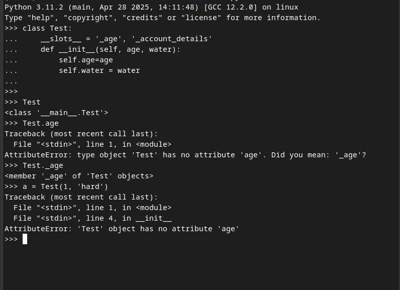

# Linked Lists

A linked list uses a distributed representation in which a lightweight object, known as a node, is allocated for each element. Each node maintains a reference to its element and one or more references to neighboring nodes in order to collectively represent the linear order of the sequence.

Elements of a linked list cannot be efficiently accessed by a numeric index k, and we cannot tell just by examining a node if it is the second, fifth, or twentieth node in the list. How ever linked lists help us avoid the following:

1. A situation where by the length of a dynamic array might be longer than the actual number of elements that it stores.

2. Amortized bounds for operations may be unacceptable in real-time systems.

3. Insertions and deletions at interior positions of an array are expensive.

# Singly Linked Lists

A singly linked list, in its simplest form is a collection of nodes that collectively form a linear sequence. Each node stores a reference to an object that is an element of the sequence, as well as a reference to the next node of the list, or none if there are no further nodes.

The list instance maintains a member named head that identifies the first node of the list, and in some applications another member named tail that identifies the last node of the list.

The first and last node of the list are known as the head and tail of the list respectively.

The process of traversing a linked list is known as link hopping or pointer hopping.

A linked list instance is an object, and that object consists of a list of other objects known as nodes, it is necessary for the linked list instance to keep a reference to the first node, or store the first node, as without the first node, it cannot locate any other node, or the sequence itself cannot be achieved.

In best practice the linked list instance should also store the reference to the last node, as if this is not stored, in order to obtain it, we would need to traverse the whole list. Similarly it is better to keep an instance variable that stores the number of nodes in the list usually called the size of the list, as this would facilitate easy retrieval of the size of the list, as opposed to traversing the whole list, just to get its count.

# Inserting an Element at the Tail of a Singly Linked List

We can also easily insert an element at the tail of the list, provided we keep a reference to the tail node. In this case, we create a new node assign its next reference to None, set the next reference of the tail to point to this new node, and then update the tail reference itself to this new node.

# Deleting an elements from a singly linked list

Deleting an element from the front of a singly linked list is easy, just assign the head to the current heads next reference.

The problem comes when we try to remove the tail of a singly linked list, this will involve setting the next value to none for the node before the tail. But there exist no efficient way of doing this in a singly linked list, as even if you maintain a variable that references the last node, there will be no way to get the previous node from the last node, we would have to traverse the linked list up until the node before the last, and then set its next reference to None, this is computationally expensive.

This problem can be solved using a linked list.

# Notes

By default, python represents each namespace with an instance of the built-in dict class that maps identifiers in that scope to their associated objects. While a dictionary supports efficient lookups, it requires additional memoery usage beyond the raw data that it stores.

Python provides a more streamlined representation for all instances of a class, that class definition must provide a class-level member named __slots__ that is assigned a fixed sequence of strings that serve as names for instance variables.

e.g

__slots__  = '_age', '_account_no', '_location'

